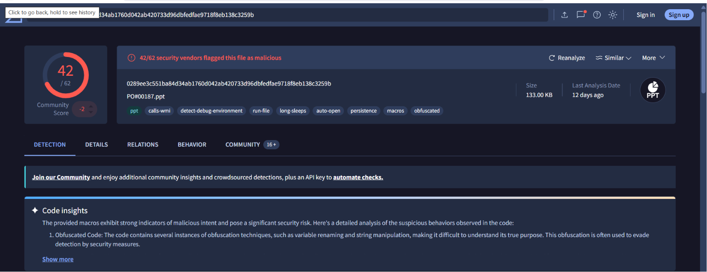

# SOC001 - Suspicious PowerShell

## Alert Details

| Field | Value |
|-------|-------|
| Severity | Medium |
| Device | Windows-10 |

---

## Investigation

The alert was triggered because...

---

## IOC

- IP:
- URL:
- Hash:

---

## MITRE ATT&CK

| Technique | ID |
|-----------|----|
| PowerShell | T1059.001 |

---

## Conclusion

This alert is malicious because...

